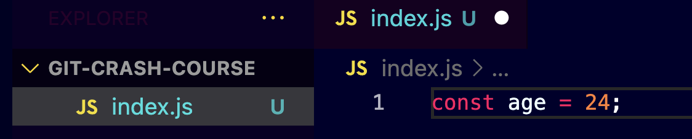
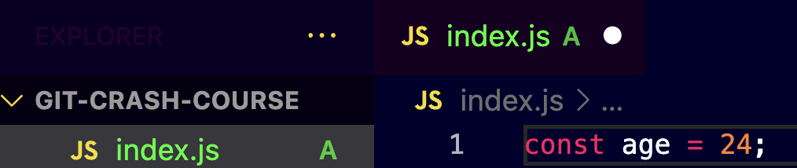
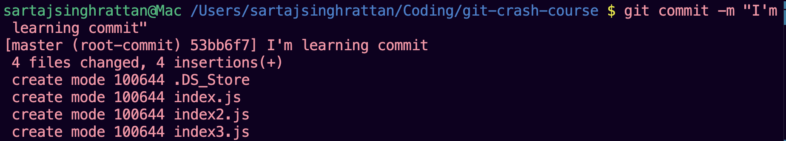

# Unleash the Power of Git and GitHub: Your Journey Starts Here!

## Why Documentation is Important?
Documentation is crucial to any project as it ensures that everyone understands the tools or code's purpose, functionality, and usage. It acts as a guide for new developers, provides clarity for collaborators, and ensures that the project is maintainable and scalable. This documentation is designed to help you understand Git and GitHub, two essential tools for modern developers.

## What is Git? 
Git is a free and open-source version control system created by Linus Torvalds in 2005. It helps track changes in your code, manage different versions, and make it easy to return to earlier stages if needed. While Git is installed on your personal computer to manage code locally, it becomes even more powerful when combined with platforms like GitHub, which enable sharing and collaboration.

## What is GitHub? 
GitHub, launched in 2008, is a web-based platform built around Git. Its purpose is to provide a collaborative space where developers can host repositories, share code, and manage projects seamlessly. With features like issue tracking, pull requests, and branch management, GitHub makes teamwork easier and ensures code quality in collaborative environments.

## Installation 
### Git
Git Installation Instructions

To install Git, follow these steps:

1. **Visit the Official Website:**  
   Go to [Git’s official website](https://git-scm.com/).

2. **Download the Installer:**  
   - Select the installer based on your OS:  
     - Windows  
     - macOS  
     - Linux  

3. **Run the Installer:**  
   - Follow the on-screen instructions.  
   - Default settings are sufficient for most users.  

4. **Verify Installation:**  
   - Open your terminal or command prompt.  
   - Run the following command to verify the Git installation:
     ```bash
     git --version
     ```
     This will display the installed version of Git.
     
### GitHub

Follow these steps to create your GitHub account:

1. **Visit the GitHub Website:**  
   Go to [GitHub's official website](https://github.com/).

2. **Sign Up for an Account:**  
   - Click on the **"Sign up"** button in the top-right corner.
   - Fill out the required information:
     - **Email address**
     - **Username**
     - **Password**
   - Complete the verification steps (if prompted).

3. **Choose Your Plan:**  
   - Select the **free plan** or a paid plan based on your requirements.
   - Most users can start with the free plan, which includes unlimited public and private repositories.

4. **Confirm Your Email Address:**  
   - Check your email for a confirmation message from GitHub.
   - Click on the verification link in the email to activate your account.

5. **Set Up Your GitHub Profile (Optional):**  
   - Customize your account by adding a profile picture, bio, and other personal details.
   - This step can be skipped and completed later.

6. **Start Using GitHub:**  
   - Log in to your account.
   - Explore repositories or create your own!
   
## Basic Git Commands
Before diving into Git commands, let’s create a project directory named **git-crash-course** to practice. The commands below will help you understand how to initialize a Git repository and track changes.

### git init
We create a file inside the project and name it "index.js". Feel free to use any programming language as the content of the file dosen't matter for this tutorial.
Now to initialize a new git repository we enter the following command into the terminal of the IDE (VS code in my case):


This command creates a hidden .git folder in your project directory, marking it as a Git repository. After running git init, any files present in the directory will show a U symbol in VS Code’s file explorer, indicating they are untracked by Git. 



The U symbol means Git is aware of the file but is not yet tracking changes to it.

### git add 
Now that we've initialized git we want the git to track for all the changes made in the files. we can do that by using the **git add filename** (filename here is index.js). This command moves files from the working directory to the staging area. Git starts tracking changes for staged files, preparing them for the next commit.


After hitting Enter, the status of index.js changes from untracked to staged (index added).



This indicates that Git is now tracking the file, and it is ready to be committed.

### git add .
Now, let's create another file and name it index2.js.


Now, we also want to track this file using git, we can very well use the git add command again, however when working with multiple files, it can be tedious to add each file individually. Instead, you can use the **git add .** command to add all changes in the current directory. 

### git status
The git status command provides information about the current state of your Git repository. It helps you understand which files are being tracked, which files have changes, and which files are staged for the next commit. 
**git status shows:**
- Untracked Files: Files that are not yet being tracked by Git.
- Tracked Files with Changes: Files that Git is tracking but have been modified since the last commit.
- Staged Files: Files that have been added to the staging area and are ready to be committed.

To demonstrate, let's create another file index3.js. Now, let's run the git status command in the terminal.



Here, we can see that index3.js is listed under untracked files, which makes sense because it hasn’t been added to Git using the **git add** command in the terminal.


