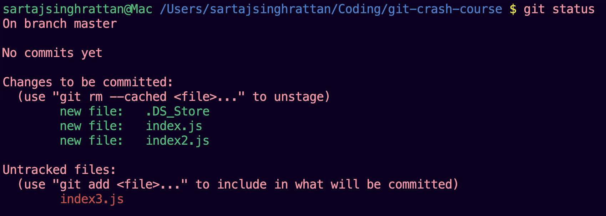
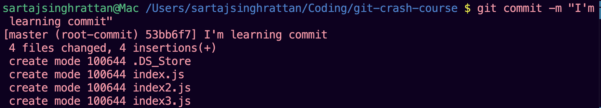
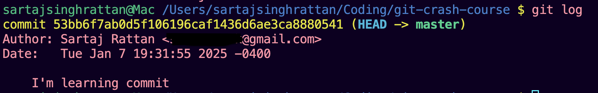
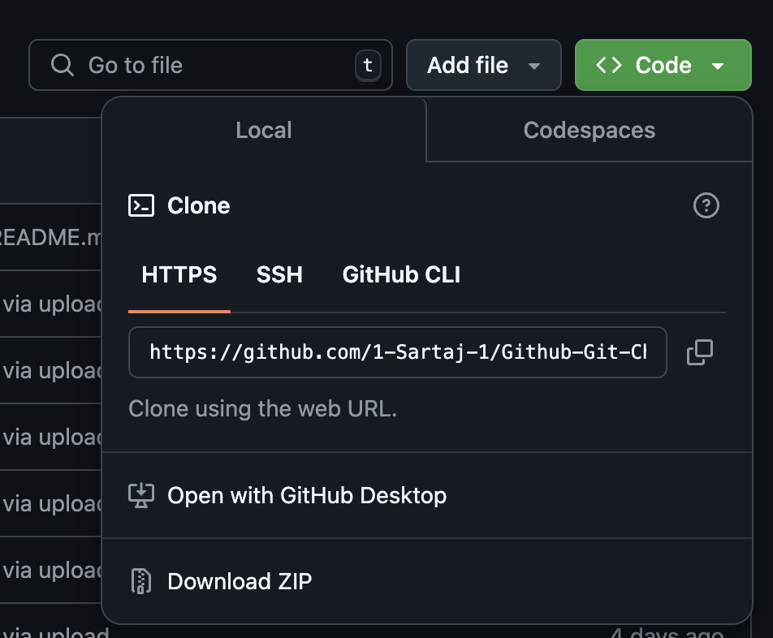

# Unleash the Power of Git and GitHub: Your Journey Starts Here!

## Why Documentation is Important?
Documentation is crucial to any project as it ensures that everyone understands the tools or code's purpose, functionality, and usage. It acts as a guide for new developers, provides clarity for collaborators, and ensures that the project is maintainable and scalable. This documentation is designed to help you understand Git and GitHub, two essential tools for modern developers.

## What is Git? 
Git is a free and open-source version control system created by Linus Torvalds in 2005. It helps track changes in your code, manage different versions, and make it easy to return to earlier stages if needed. While Git is installed on your personal computer to manage code locally, it becomes even more powerful when combined with platforms like GitHub, which enable sharing and collaboration.

## What is GitHub? 
GitHub, launched in 2008, is a web-based platform built around Git. Its purpose is to provide a collaborative space where developers can host repositories, share code, and manage projects seamlessly. With features like issue tracking, pull requests, and branch management, GitHub makes teamwork easier and ensures code quality in collaborative environments.

## Installation 
### Git
Git Installation Instructions

To install Git, follow these steps:

1. **Visit the Official Website:**  
   Go to [Git’s official website](https://git-scm.com/).

2. **Download the Installer:**  
   - Select the installer based on your OS:  
     - Windows  
     - macOS  
     - Linux  

3. **Run the Installer:**  
   - Follow the on-screen instructions.  
   - Default settings are sufficient for most users.  

4. **Verify Installation:**  
   - Open your terminal or command prompt.  
   - Run the following command to verify the Git installation:
     ```bash
     git --version
     ```
     This will display the installed version of Git.
     
### GitHub

Follow these steps to create your GitHub account:

1. **Visit the GitHub Website:**  
   Go to [GitHub's official website](https://github.com/).

2. **Sign Up for an Account:**  
   - Click on the **"Sign up"** button in the top-right corner.
   - Fill out the required information:
     - **Email address**
     - **Username**
     - **Password**
   - Complete the verification steps (if prompted).

3. **Choose Your Plan:**  
   - Select the **free plan** or a paid plan based on your requirements.
   - Most users can start with the free plan, which includes unlimited public and private repositories.

4. **Confirm Your Email Address:**  
   - Check your email for a confirmation message from GitHub.
   - Click on the verification link in the email to activate your account.

5. **Set Up Your GitHub Profile (Optional):**  
   - Customize your account by adding a profile picture, bio, and other personal details.
   - This step can be skipped and completed later.

6. **Start Using GitHub:**  
   - Log in to your account.
   - Explore repositories or create your own!
   
## Basic Git Commands
Before diving into Git commands, let’s create a project directory named **git-crash-course** to practice. The commands below will help you understand how to initialize a Git repository and track changes.

### git init
We create a file inside the project and name it "index.js". Feel free to use any programming language as the content of the file dosen't matter for this tutorial.
Now to initialize a new git repository we enter the following command into the terminal of the IDE (VS code in my case):


This command creates a hidden .git folder in your project directory, marking it as a Git repository. After running git init, any files present in the directory will show a U symbol in VS Code’s file explorer, indicating they are untracked by Git. 


The U symbol means Git is aware of the file but is not yet tracking changes to it.

### git add 
Now that we've initialized git we want the git to track for all the changes made in the files. we can do that by using the **git add filename** (filename here is index.js). This command moves files from the working directory to the staging area. Git starts tracking changes for staged files, preparing them for the next commit.


After hitting Enter, the status of index.js changes from untracked to staged (index added).


This indicates that Git is now tracking the file, and it is ready to be committed.

### git add .
Now, let's create another file and name it index2.js.


Now, we also want to track this file using git, we can very well use the git add command again, however when working with multiple files, it can be tedious to add each file individually. Instead, you can use the **git add .** command to add all changes in the current directory. 

### git status
The git status command provides information about the current state of your Git repository. It helps you understand which files are being tracked, which files have changes, and which files are staged for the next commit. 
**git status shows:**
- Untracked Files: Files that are not yet being tracked by Git.
- Tracked Files with Changes: Files that Git is tracking but have been modified since the last commit.
- Staged Files: Files that have been added to the staging area and are ready to be committed.

To demonstrate, let's create another file index3.js. Now, let's run the git status command in the terminal.



Here, we can see that index3.js is listed under untracked files, which makes sense because it hasn’t been added to Git using the **git add** command in the terminal.

### Concept: What is staging (index)?
Now that we know how to add a file in Git, let's talk about a concept called staging. When we make changes in a file after **git init** or even **git add**
the changes happen on your local working directory/IDE (hence the 'U' if you recall the **git init** section). When we use the **git add** or **git add .** command, the file is added to a staging area. It acts as a middle ground between your working directory and the repository. It’s a place where you can stage (add) changes you’ve made in your working directory. Changes in the staging area are not part of the repository yet; they’re only added when you commit.

### git rm --cached
I would like you to focus on the image in the terminal command of **git status**. The command git **rm --cached <file>** is used to unstage a file or remove it from the Git index (staging area) without deleting the actual file from your working directory. This command is especially helpful when you accidentally add sensitive or unnecessary files to the staging area and want to stop Git from tracking them.

### git commit -m
The git commit -m command is used to save changes from the staging area to the Git repository with a short, descriptive message about the changes being committed.
Commit messages describe the changes made in that commit. They help track and understand the history of your project.



There are some rules for writing clean commit messages so that it's easier for you or your team to understand the code modifications:
Commit Message Rules:
- **Use Present Tense**: Write commit messages in the present tense (e.g., “Add login validation” instead of “Added login validation”).
- **Start with a Capital Letter**: Begin every commit message with a capitalized first letter for consistency and readability.
- **Keep It Short and Descriptive**: Limit commit messages to 50 characters or less for the title/summary line.
- **Commit Frequently for Small Changes**: Commit after making meaningful changes, such as adding or modifying a feature, fixing a bug, or updating documentation. Avoid committing large chunks of code all at once.
- **Use Prefixes for Categorization**: Add prefixes for clarity: **feat**: For new features (e.g., feat: Add user authentication), **fix**: For bug fixes (e.g., fix: Resolve login timeout issue), **docs**: For documentation updates (e.g., docs: Update README.md), **chore**: For general maintenance (e.g., chore: Update dependencies), **refactor**: For code refactoring (e.g., refactor: Optimize search algorithm).
- **Focus on One Change per Commit**: Each commit should address one feature, bug, or task. This makes the history easier to track and debug.

### git log
The git log command is used to display the commit history of your Git repository. It shows a chronological list of all commits, allowing you to track changes and identify who made them, when, and why.



The default output of git log includes:
- **Commit Hash**: A unique identifier for each commit. 
- **Author**: The name and email of the person who made the commit.
- **Date**: The date and time the commit was made.
- **Commit Message**: A description of what the commit includes.

### git clone
The git clone command creates a local copy of a remote Git repository. This is typically the first step when you want to work on an existing project hosted on a platform like GitHub. Use it as follows:
- Get the Repository URL: Navigate to the repository you want to clone on your Github. Copy the repository’s URL, HTTPS/SSH.

- Open Your Terminal: Navigate to the directory where you want to clone the repository.```bash cd ~/Projects```
- Clone the Repository: ```git clone <repository-url>```


## Collaboration with Github
GitHub is a Git server platform that hosts Git repositories and allows multiple users to collaborate on version-controlled projects. It facilitates the storage, sharing, and management of repositories while enabling distributed workflows. The use cases are as follows:
- **Centralized Repository Hosting**: Acts as a central location where all team members can push and pull changes.
- **Collaboration Tools**: Supports branching, merging, and pull requests for collaborative development.
- **Access Control**: Manages user permissions for reading, writing, or administering repositories.
- **Remote Access**: Enables access to online repositories using protocols like HTTPS or SSH.

### Remote
Git remote refers to a connection to a repository hosted on a server (e.g., GitHub, GitLab, Bitbucket). The git remote command manages these connections, allowing you to link your local repository to one or more remote repositories. The following command links your local repository to a remote repository.
``` bash
 git remote add <name> <url>
```
By Convention: The name is often set to origin, but you can choose any name for your remote.
 
### Branch
In Git, a branch is a lightweight, movable pointer to a specific commit in your project’s history. It represents an independent line of development, allowing you to work on a feature, bug fix, or experiment without affecting the main codebase. Think of a branch as a separate timeline for your project. You can make changes, commit them, and even discard them without impacting the main branch until you’re ready to merge. The benifits of branching are as follows:
- **Feature Development**: Branches allow you to work on new features without affecting the stable main branch.
- **Bug Fixing**: You can create a branch specifically for fixing a bug, keeping your work isolated and organized.
- **Collaboration**: Multiple developers can work on different branches of the same project, merging their work when it’s ready.
- **Experimentation**: Use branches to test out ideas or changes. If they don’t work out, you can simply delete the branch.

**Git Commands**
- **List All Branches**: ```git branch```
- **Create a branch**: ```git branch <branch-name>```
- **Switch to a Branch**: ```git switch <branch-name>```
- **Create a branch and switch into it at the same time**: ```git switch -c feature-login```
- **Delete a Branch**: ```git branch -d <branch-name>```
- **Merge a branch into main**: ```git merge <branch-name>```

**Git Branch Naming Convention**:
- **Use Descriptive Names**: Branch names should clearly indicate the purpose of the branch. Example: feature/login-page or bugfix/logout-error.
- **Lowercase and Use Hyphens**: Stick to lowercase letters and use hyphens (-) to separate words. Example: feature/add-user-profile.
- **Avoid Special Characters**: Use alphanumeric characters and hyphens to keep names simple and compatible across tools.
- **Avoid spaces or characters like #, $, or &**.
- **Keep It Short but Meaningful**: Aim for brevity while still being descriptive. Example: hotfix/api-crash.

**Git Branch Recommended Naming Patterns**:
- **Feature Branches**: For new features or enhancements. ```feature/<feature-name>```
- **Bugfix Branches**: For fixing bugs. ```bugfix/<issue-description>```
- **Hotfix Branches**: For urgent fixes to production issues. ```hotfix/<issue-description>```
- **Release Branches**: For preparing a release or deployment. ```release/<version-number>```
- **Development Branches**: For ongoing or experimental development. ```dev/<branch-name>```
- **Testing Branches**: For testing purposes. ```test/<branch-name>```
